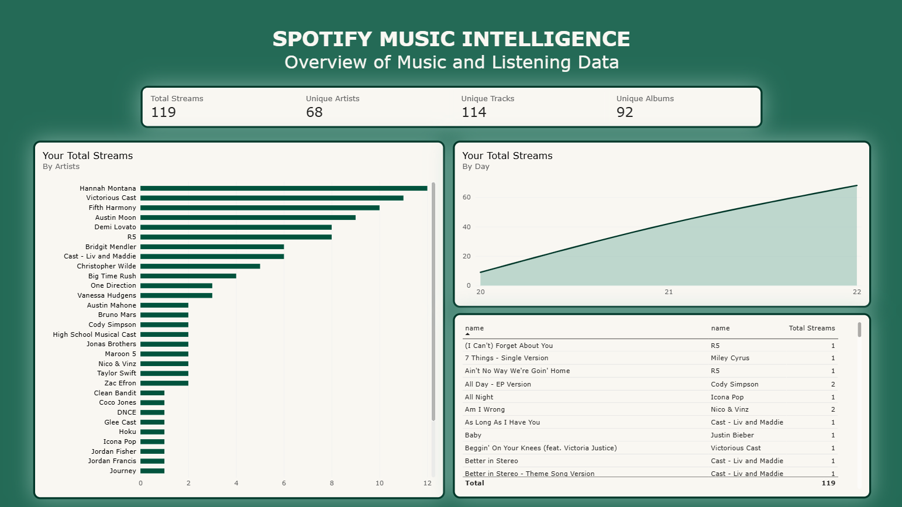
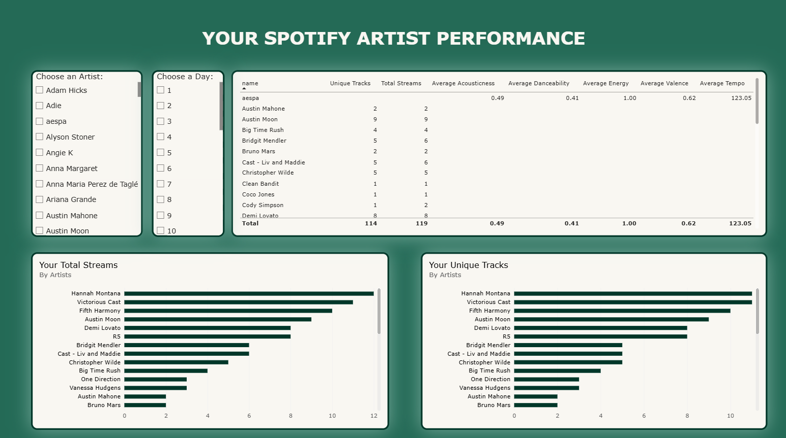
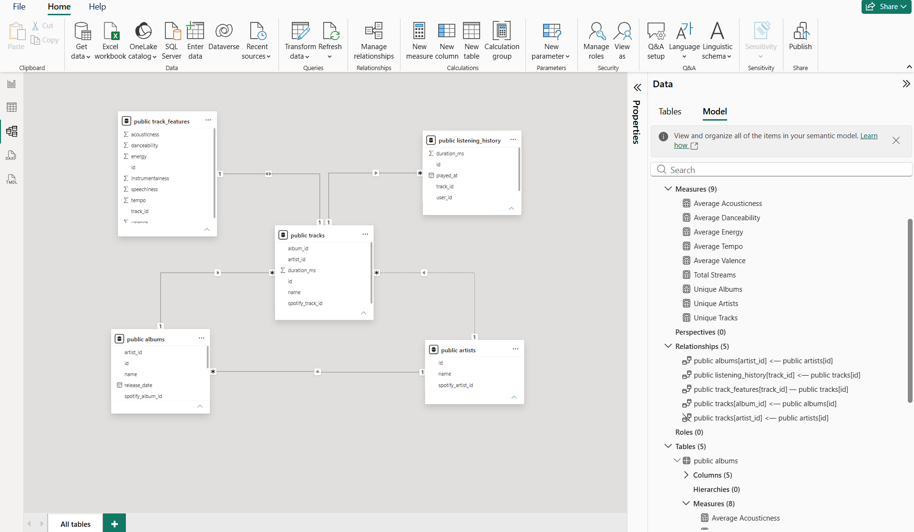
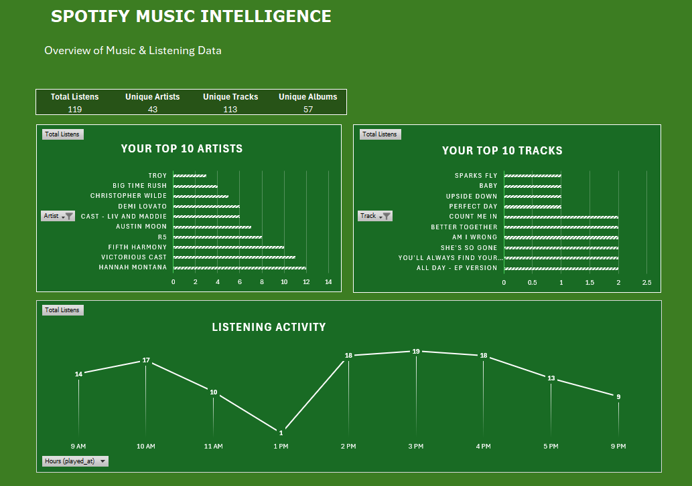
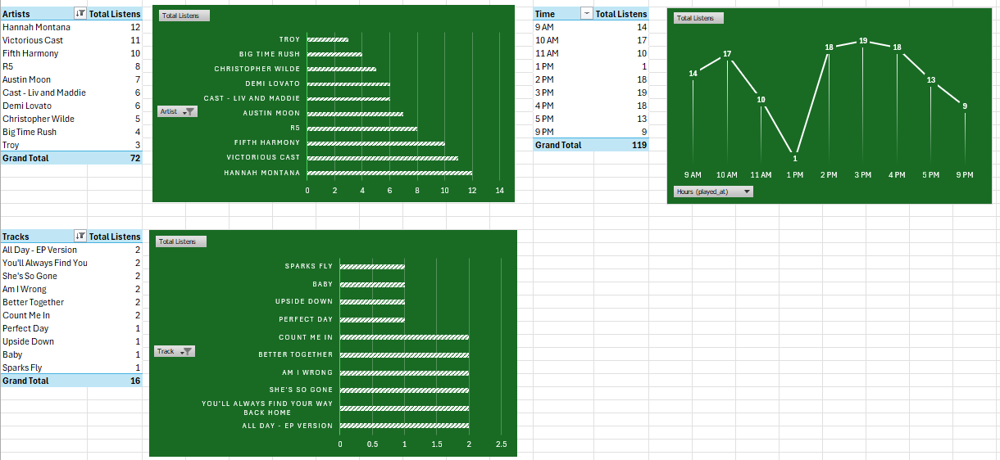

# Spotify Music Intelligence

A data analytics-focused music intelligence platform that analyzes Spotify data to discover patterns in artist, track, albums, listening behavior, and audio characteristics.

>  **Status:** Complete — Core backend, PostgreSQL integration, Spotify authentication, analytics APIs, and interactive dashboard are implemented. Implemented Power BI and Excel analytics in respective folders.

---

## Project Overview

**Spotify Music Intelligence** is a data-driven analytics project designed to explore Spotify music data and answer questions about music popularity, streaming performance, artist consistency, and audio characteristics.

**Tech Stack:**
Python · Flask · PostgreSQL · SQLAlchemy · SQL · Spotify Web API · OAuth 2.0 · JavaScript · Tailwind CSS · Chart.js · Pandas · Microsoft Power BI · Microsoft Excel

**Core Focus:**
Data Analytics · ETL/Data Cleaning · Database Design · API Integration · Data Visualization · Web Dashboard

---

## External Analytics Dashboard Overview

** Microsoft Power BI **

** Microsoft Excel **

